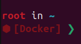

# MiRo Docker

MiRo & MiRo Developer Kit simulation and development environment in Docker.

### ⚙️ [Installation](docs/INSTALL.md)

### 📝 [Changelog](docs/CHANGELOG.md)

### 🧠 [To-Do](docs/TODO.md)

## 🚀 Quick Start

### Host OS
```bash
# Clone this repository, either into your host OS or into the WSL distro
git clone https://github.com/AlexandrLucas/miro-docker.git

# Pull/build image and start a MiRo Docker container (select default values)
./miro-docker.sh start

# Attach a terminal to the running container
./miro-docker.sh term
```
Run `miro-docker.sh` without arguments for help on usage.

>Note: You can add a `miro-hub` alias for the `miro-docker.sh` script onto your 
PATH by running `tools/miro-hub-installer.sh`.  
This allows to run the script from any folder.

### MiRo Docker
Check for the Starship Docker prompt to ensure you're in the right place:



The MiRo docker image ships with an all-in-one `miro` script.  
Below are some examples of the functionality it provides.

#### Example 1. Gazebo simulator + MiRo GUI app
You'll need to open three terminal windows and run the following:

```bash
[Terminal 1] roscore
[Terminal 2] miro sim
[Terminal 3] miro gui
```

#### Example 2. Gazebo simulator + MiRo autonomous mode + MiRo dashboard
You'll need quite a few terminal windows for this one!

>Note: The command in *Terminal 6* is used to make the blue ball move in a
periodic motion, providing a stimuli for the MiRo.

The final bit, MiRo dashboard, can be viewed by following the link in the output 
of *Terminal 7*.

```bash
[Terminal 1] roscore
[Terminal 2] miro sim
[Terminal 3] miro demo
[Terminal 4] miro demo caml
[Terminal 5] miro demo camr
[Terminal 6] rosrun com3528_examples ball_mover.py 
[Terminal 7] miro dashboard
```

#### Example 3. Three MiRos chasing the ball in the simulator 
This example shows the power of `roslaunch` files.

>Note: `roscore` starts automatically when running a `roslaunch` file.

```bash
[Terminal] roslaunch com3528_examples sim_football.launch
```

#### Example 4. Running MiRo GUI for a real MiRo
By default, the MiRo Docker image works in simulation, but by changing a few 
settings you can just as easily work a physical MiRo.
You'll need to do the following:
1. Ensure that the MiRo and your computer are on the same subnet and are visible to each other.
2. Switch the mode by running `miro mode robot` (as opposed to `miro mode sim`).
3. Input the IPv4 address of your MiRo by running `miro ip update`.
4. Open a new terminal and run `miro status` to ensure that everything is set up correctly. 
5. Run `miro gui`.
